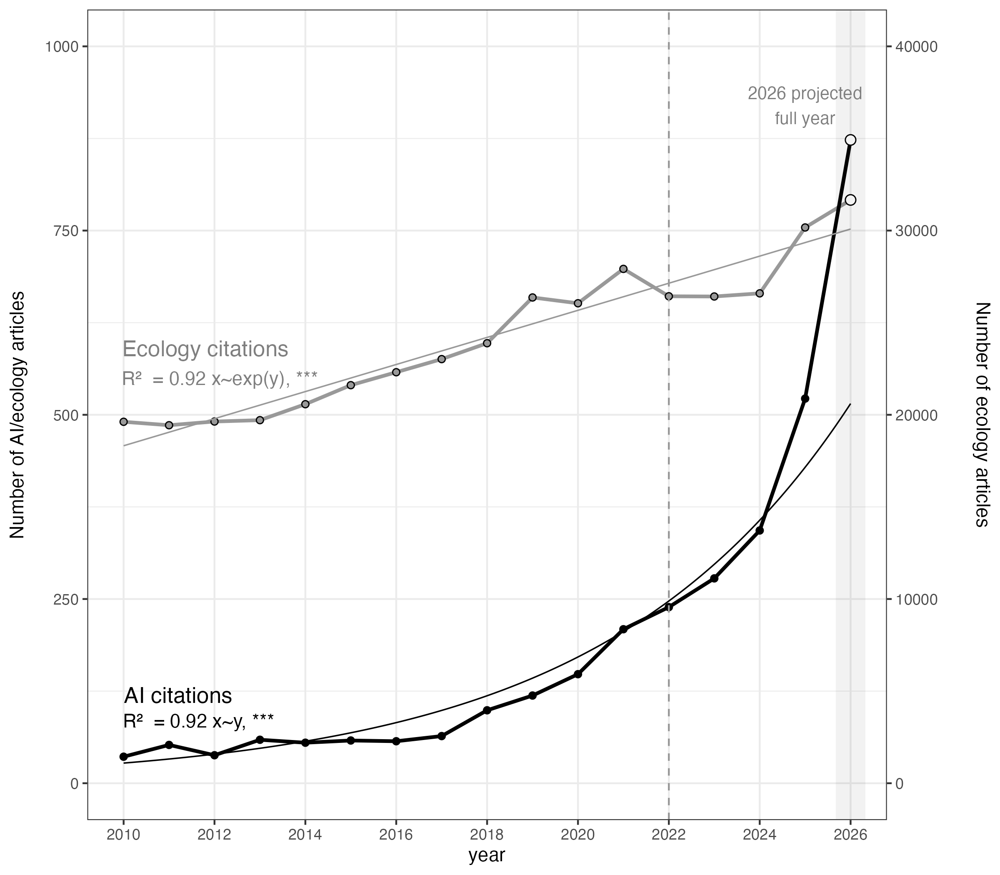

# "Ecology must shape AI before AI reshapes ecology"

Code, output, and `.bib` data files for Figure 1:




Figure 1. Publication on trend in ecological studies with ar ficial intelligence (AI), based on Web of
Science searches following Ryo (2023). The vertical dashed line marks the endpoint of the original 2011–
2022 dataset (Ryo 2023). Extending the search to 2026 shows that the number of ecological studies
continues to grow at a steady rate, while AI-related ecological studies have accelerated in the last
decade at a rate exceeding exponential growth.

```{r eval=FALSE}
# Publication trend in ecological studies with AI (Web of Science)
# Import bibtex (AI series) + counts export (ecology series) -> table ->
# 2026 projection -> RDS -> dual-axis figure.

# Note: pro-rata assumes publications land evenly across the year, which is roughly true
# in aggregate but tends to undershoot because December is usually the heaviest month.
# WoS indexing also lags real time by weeks, so the Jan–Sep partial is itself slightly
# undercounted, making projections conservative


library(tidyverse)
library(bibliometrix)


# original Web of Science search from Ryo 2023 (https://esj-journals.onlinelibrary.wiley.com/doi/10.1111/1440-1703.12425)
# accessed on 10th September 2026: https://www.webofscience.com/wos/woscc/summary/d37f9278-a7e4-4fc9-b890-3fc2a6e40884-01c77d9bd7/relevance/1
# see also https://github.com/masahiroryo/Asian-ecology-with-AI-ML/blob/main/20230505_AsianEcology_bibliometrics.R

# import bib files
bib_files <- c("~/Desktop/biblio_0001_1000.bib",
               "~/Desktop/biblio_1001_2000.bib",
               "~/Desktop/biblio_2001_3000.bib",
               "~/Desktop/biblio_3001_3239.bib")   # <- edit to your actual filenames

# convert to df, predict 2026 full count
ai_raw <- convert2df(bib_files, dbsource = "wos", format = "bibtex", remove.duplicates=TRUE) |>
  mutate(year = as.integer(PY)) |>
  filter(!is.na(year)) |>
  arrange(year) |>
  filter(year >= 2010 & year <= 2026)

# set partial months based on search date
partial_months <- ((as.integer(as.Date("2026-09-10") - as.Date("2026-01-01")) + 1) / 365) *12

# count by year
ai_count <- ai_raw |>
  summarise(count=n(), .by="year") |>
  mutate(count = if_else(year == 2026,
                         round(count * 12 / partial_months),
                         count)) |>
  rename(ai = count)

# matching Web of Science search for 'ecology' in Web of Science Categories (2010-2026) accessed on 10th September 2026:
# https://www.webofscience.com/wos/woscc/summary/407f6d64-4d93-48e7-ab8e-0ca9f76cb886-01c77dd68b/relevance/1
# 403,790 results from Web of Science Core Collection, .bib files not archived


# read in *ecolog search, count by year
eco_count <- read.delim("~/Desktop/analyze.txt") |>
  select(1,2) |>
  rename(year = Final.Publication.Year, count=Record.Count) |>
  drop_na(count) |>
  mutate(year = as.integer(year)) |>
  filter(year >= 2010 & year <= 2026) |>
  arrange(year) |>
  mutate(count = if_else(year == 2026,
                      round(count * 12 / partial_months),
                      count)) |>
  rename(eco = count)

# join dataframes and pivot
eco_ai <- left_join(eco_count, ai_count)
eco_ai_long <- eco_ai |>
  pivot_longer(c(eco, ai), names_to = "category", values_to = "count")

# fit linear and log models
m_eco <- lm(eco ~ year,      data = eco_ai)
m_ai  <- lm(log(ai) ~ year,  data = eco_ai)

# print summary and extract R2 for labels
m_eco_summary <- summary(m_eco)
m_ai_summary <- summary(m_ai)

m_ai_summary_label <- paste0("R\u00b2  = ", c(round(m_ai_summary$adj.r.squared, 2)), " x~y, ***")
m_eco_summary_label <- paste0("R\u00b2  = ", c(round(m_eco_summary$adj.r.squared, 2)), " x~exp(y), ***")

# expand predictions
grid <- tibble(year = seq(2010, 2026, length.out = 200))
fit  <- grid |> mutate(eco = predict(m_eco, grid),
                       ai  = exp(predict(m_ai, grid)))


# scale secondary y axis
scalefactor <- 40

# plot
p <- ggplot() + theme_bw() +
  geom_line(data = eco_ai, aes(year, eco / scalefactor), colour = "grey60", linewidth = 1) +
  geom_line(data = eco_ai, aes(year, ai), colour = "black", linewidth = 1) +
  geom_point(data = eco_ai, aes(year, ai), shape=21, fill = "black", size = 1.6) +
  geom_point(data = eco_ai, aes(year, eco / scalefactor), shape=21, fill = "grey60", size = 1.6) +
  geom_point(data = eco_ai |> filter(year==2026), aes(year, ai), shape=21, color="black", size = 2.5, fill = "white") +
  geom_point(data = eco_ai |> filter(year==2026), aes(year, eco / scalefactor), shape=21, color="black", size = 2.5, fill = "white") +
  geom_line (data = fit,    aes(year, eco / scalefactor), colour = "grey60", linewidth = 0.4) +
  geom_line (data = fit,    aes(year, ai), colour = "black", linewidth = 0.4) +
  geom_vline(xintercept = 2026, linewidth = 8, alpha = 0.05) +
  geom_vline(xintercept = 2022, linetype="dashed", color="grey60", linewidth = 0.5, alpha = 1) +
  geom_text(aes(x = 2011.2, y = 120, label="AI citations"), size = 4.5, color = "black") +
  geom_text(aes(x = 2011.65, y = 85, label=m_ai_summary_label), color = "black") +
  geom_text(aes(x = 2011.8, y = 590, label="Ecology citations"), size = 4.5, color = "grey50") +
  geom_text(aes(x = 2012.12, y = 550, label=m_eco_summary_label), color = "grey50") +
  geom_text(aes(x = 2025, y = 920, label="2026 projected\nfull year"), color = "grey50", size=3.5) +
  scale_x_continuous(limits=c(2010,2026), breaks=seq(2010,2026,2)) +
  scale_y_continuous(
    name     = "Number of AI/ecology articles",
    limits   = c(0, 1000),
    breaks   = seq(0, 1000, 250),
    sec.axis = sec_axis(~ . * scalefactor, name = "Number of ecology articles")
  ) +
  theme(axis.title.y.left  = element_text(margin = margin(r = 10)),
        axis.title.y.right = element_text(margin = margin(l = 20)),
        panel.grid.minor.x   = element_blank())


# save plots
ggsave("~/Desktop/ai_ecology_pubtrend.png", p, width = 8, height = 7)
print(p)


```
